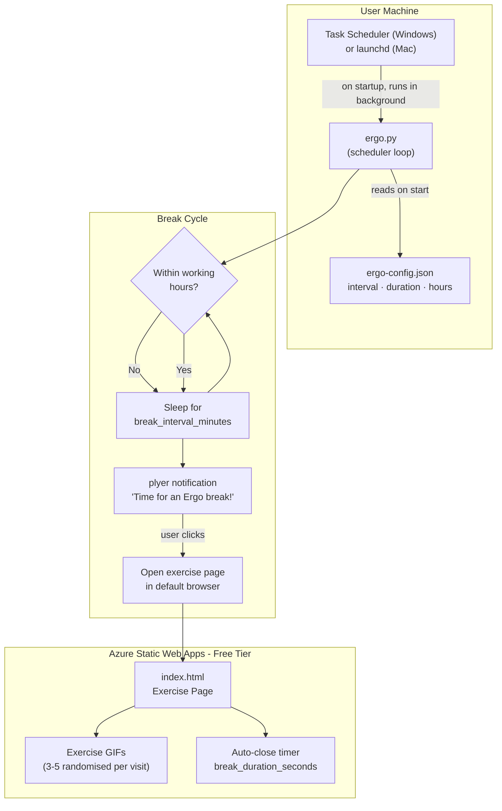
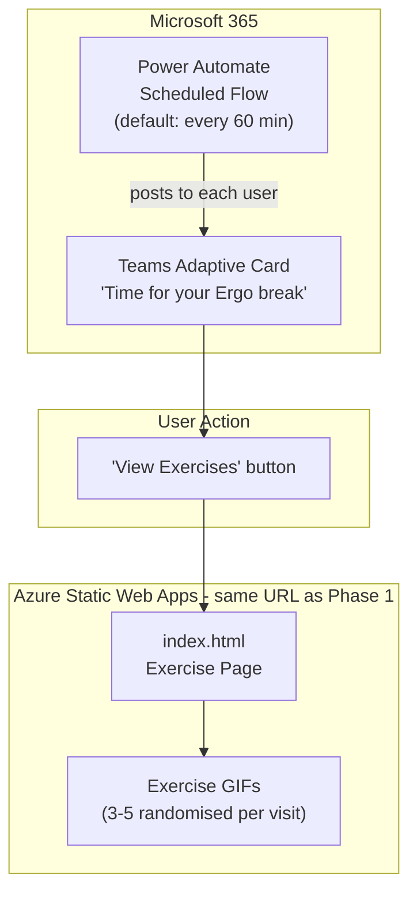

# System Design: Ergo

**Date:** 2026-04-09
**Status:** Draft
**Related ADRs:** ADR-001 (Platform), ADR-002 (Content & Hosting), ADR-003 (Interval Config)

---

## Problem Statement

Desk workers accumulate ergonomic injuries through prolonged, uninterrupted sitting and repetitive motion. Most people know they should take breaks but don't — they need an automated nudge that also tells them what to do. Ergo delivers a timed break reminder with visual exercise guidance, starting as a personal tool and scaling to the full company.

---

## Architecture Overview

### Phase 1 — Personal (Windows + Mac)

### Phase 2 — Company-wide (Teams + Power Automate)

---

## Components

### Phase 1

| Component | Technology | Purpose |
|---|---|---|
| Scheduler script | Python 3.x + `schedule` lib | Core loop: timing, working hours check, triggering notification |
| Notifications | `plyer` (cross-platform) | OS-native toast notification on Windows and Mac |
| Config file | `ergo-config.json` | User-editable: interval, break duration, working hours |
| Autostart (Windows) | Windows Task Scheduler | Runs `ergo.py` at login, in background |
| Autostart (Mac) | launchd `.plist` | Runs `ergo.py` at login, in background |
| Exercise page | HTML + CSS + JS | Displays randomised exercises at break time |
| Exercise content | Animated GIFs (free licence) | Visual demonstration of each stretch/exercise |
| Hosting | Azure Static Web Apps (free) | Serves the exercise page publicly via HTTPS URL |

### Phase 2 (additional)

| Component | Technology | Purpose |
|---|---|---|
| Reminder delivery | Power Automate scheduled flow | Replaces local script for company-wide delivery |
| Notification format | Teams Adaptive Card | In-Teams break reminder with link to exercise page |
| User management | Power Automate flow config | Opt-in user list or company-wide channel post |

---

## Data Flow

### Phase 1 — Break Cycle

1. Machine starts → Task Scheduler / launchd launches `ergo.py`
2. Script reads `ergo-config.json` (falls back to defaults if missing)
3. Loop begins: sleep for `break_interval_minutes`
4. On wake: check if current time is within `start_hour`–`end_hour`
5. If within hours: fire `plyer` notification
6. User clicks notification → script opens exercise page URL in default browser
7. Page loads, JavaScript picks 3–5 random exercises from the content library
8. After `break_duration_seconds`, page shows a "Session complete" message (optional auto-close)
9. Loop returns to step 3

### Phase 2 — Teams Delivery

1. Power Automate flow triggers on schedule (central default: 60 min)
2. Flow posts Adaptive Card to each target user's Teams chat
3. Card displays break message + "View Exercises" button
4. Button opens the Azure Static Web Apps exercise page URL
5. Same page, same randomised experience as Phase 1

---

## Build Plan

### Milestone 1 — Core Script  *(build first, no UI)*
**Goal:** Working notification firing on schedule on Windows.

- [ ] `ergo.py`: config loader with fallback defaults
- [ ] `ergo.py`: working-hours check (`start_hour` / `end_hour`)
- [ ] `ergo.py`: `schedule` loop firing `plyer` notification at interval
- [ ] `ergo.py`: notification click opens hardcoded placeholder URL
- [ ] `ergo-config.json`: all four fields with sensible defaults
- [ ] Manual test: notification fires, respects working hours, interval is correct

**Files produced:** `ergo.py`, `ergo-config.json`

---

### Milestone 2 — Exercise Page  *(content + hosting)*
**Goal:** A real, usable exercise page live on Azure Static Web Apps.

- [ ] Source 8–12 free-licence ergonomic exercise GIFs (see Content Sources below)
- [ ] `index.html`: exercise card layout (GIF + name + body area + duration)
- [ ] `index.html`: JavaScript picks 3–5 random exercises on each page load
- [ ] `index.html`: countdown timer and "Session complete" message after `break_duration_seconds`
- [ ] Deploy to Azure Static Web Apps (free tier) via GitHub repo
- [ ] Smoke test: page loads, exercises randomise correctly, timer fires

**Files produced:** `index.html`, `exercises.js` (or inline), GIF assets

---

### Milestone 3 — Integration & Autostart  *(end-to-end v1)*
**Goal:** Full break cycle running automatically on Windows login.

- [ ] Update `ergo.py` to open the live Azure Static Web Apps URL
- [ ] Windows Task Scheduler setup (XML task definition or `schtasks` command)
- [ ] End-to-end test: machine restart → script starts → notification fires → page opens → timer completes
- [ ] Write `README.md` with setup instructions (install Python, install deps, configure Task Scheduler)

**Files produced:** `README.md`, Task Scheduler setup instructions

---

### Milestone 4 — Cross-platform (Mac)  *(Phase 2 prerequisite)*
**Goal:** Same script works on Mac without code changes.

- [ ] Test `plyer` notifications on macOS
- [ ] Write `launchd` `.plist` for autostart on Mac login
- [ ] Update `README.md` with Mac setup section
- [ ] Verify config file path resolves correctly via `pathlib.Path`

---

### Milestone 5 — Company Rollout (Teams + Power Automate)
**Goal:** Break reminders delivered to all company users via Teams, zero per-user installation.

- [ ] Design Teams Adaptive Card (break message + exercise page button)
- [ ] Build Power Automate scheduled flow
- [ ] Test flow with small group (5 users) before full rollout
- [ ] Write distribution guide: how to opt in, how to adjust settings
- [ ] Announce to company with opt-in instructions

---

## Key Decisions

| Decision | Choice | Rationale |
|---|---|---|
| Notification library | `plyer` | Cross-platform (Windows + Mac) — no rewrite for Phase 2 |
| Scheduling | `schedule` library inside script | OS-agnostic; Task Scheduler / launchd just launch the script |
| Content format | Animated GIFs | Works in browser and Teams Adaptive Cards; no video player needed |
| Hosting | Azure Static Web Apps (free) | Azure-aligned, CI/CD, zero cost, single URL for both phases |
| Config | JSON file | Simple, human-editable, no UI required in v1 |
| File paths | `pathlib.Path` | Cross-platform path resolution |

*Full rationale in ADR-001, ADR-002, ADR-003.*

---

## Exercise Content Sources

Free-licence GIF sources to evaluate before building Milestone 2:

- **Giphy / Tenor** — search "desk stretch", "office exercise", "neck stretch" (check licence per GIF)
- **Pexels / Unsplash** — some have short video clips convertible to GIF
- **NHS / ergonomics.org** — public domain illustrated guides
- **Custom production** — record 10-second clips and convert to GIF with `ffmpeg` if sourcing fails

Target: 12 exercises covering neck, shoulders, wrists, back, and eyes. 3–5 shown per break, randomised.

---

## Open Questions

1. **GIF sourcing** — Do quality free-licence ergonomic GIFs exist, or do we need to produce them? (Answer before Milestone 2)
2. **Azure subscription** — Is there an existing Architech Azure subscription to host the Static Web App, or does this need a new one?
3. **Teams admin consent** — For Phase 2, who approves the Power Automate flow to send proactive Teams messages company-wide?
4. **Exercise selection logic** — Should the page remember which exercises were shown recently and avoid repeating them? (Nice-to-have for v1.1)
5. **Mac testing** — Is there a Mac available to validate Milestone 4 before company rollout?

---

## Risks

| Risk | Likelihood | Impact | Mitigation |
|---|---|---|---|
| Quality ergonomic GIFs unavailable free | Medium | Medium | Record simple clips with phone + convert via ffmpeg |
| `plyer` notification not clickable on some Windows configs | Low | High | Test early (Milestone 1); fallback: notification auto-opens browser without click |
| Teams admin consent delayed | Medium | Medium | Phase 1 works independently; Phase 2 is not blocked by consent for personal use |
| Azure Static Web Apps URL changes | Low | Low | Pin the URL in config; update in one place |
